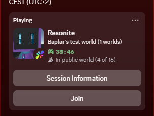

# ExampleMod

A [ResoniteModLoader](https://github.com/resonite-modding-group/ResoniteModLoader) mod for [Resonite](https://resonite.com/) that adds fancy features to the Discord Rich Presence integration. Compatible with Windows and Linux.

## Screenshots

## Installation
1. Install [ResoniteModLoader](https://github.com/resonite-modding-group/ResoniteModLoader).
1. Extract [ResoniteDiscordRpc.zip](https://github.com/Baplar/ResoniteDiscordRpc/releases/latest/download/ResoniteDiscordRpc.zip) into your Resonite install folder. This folder should be at `C:\Program Files (x86)\Steam\steamapps\common\Resonite` for a default install.
    - Alternatively, place [ResoniteDiscordRpc.dll](https://github.com/Baplar/ResoniteDiscordRpc/releases/latest/download/ResoniteDiscordRpc.dll) into your `rml_mods` folder.
    - Then, place [DiscordRPC.dll](https://github.com/Baplar/ResoniteDiscordRpc/releases/latest/download/DiscordRPC.dll) into your `rml_libs` folder.
1. Start the game. If you want to verify that the mod is working you can check your Resonite logs.
